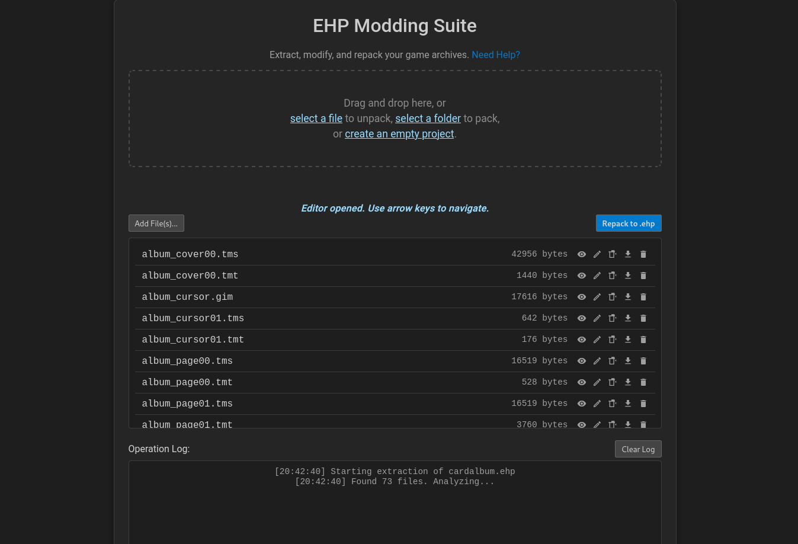
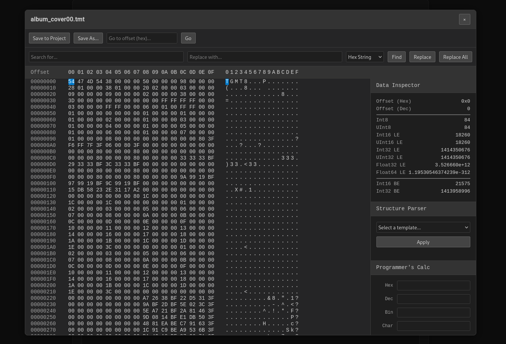

# EHP Modding Suite

A powerful, browser-based, all-in-one tool for unpacking, editing, and repacking EHP archives, primarily used in the **Yu-Gi-Oh! Tag Force** series. This project is a complete JavaScript conversion and significant expansion of the original C++ `ehppack` tool by Xan/xan1242.

It runs entirely in your web browser, requiring no installation, and all file processing is done locally on your machine for maximum privacy and speed.

---

## Key Features

This suite goes far beyond simple packing and unpacking, offering a complete modding workflow in a single interface.

*   **Full EHP Archive Support:**
    *   Unpack `.ehp` files into a live, editable project.
    *   Create new projects from local folders or from scratch.
    *   Repack projects into a game-ready `.ehp` file with correctly calculated offsets.

*   **Live Project Management:**
    *   **Add, Remove, & Rename:** Manage files directly in the browser without needing to manipulate a zip archive.
    *   **File Previews:** Instantly preview common image formats (PNG, JPG), audio, and text files.
    *   **Graphical Pointer Editor:** A dedicated UI for editing `*-ptrs.txt` files, allowing you to assign pointers by selecting filenames from a dropdown instead of calculating memory offsets.

*   **Advanced Hex Editor:** A professional-grade hex editor built for modding.
    *   **Navigation:** "Go to Offset", arrow key navigation, and scrolling.
    *   **Editing:** Modify bytes directly in hex or ASCII views.
    *   **Undo/Redo:** Full support for undo (<kbd>Ctrl</kbd>+<kbd>Z</kbd>) and redo (<kbd>Ctrl</kbd>+<kbd>Y</kbd>).
    *   **Search & Replace:** Find and replace byte sequences (Hex only).
    *   **Data Inspector:** A real-time panel that interprets the data under the cursor as various types (Int16, UInt32, Float32, etc.) in both Little and Big Endian.
    *   **Structure Parser:** Apply predefined templates (e.g., for file headers) to view data in a structured, human-readable format.
    *   **Programmer's Calculator:** A built-in utility for converting between Hex, Decimal, Binary, and Character values, with endianness support.

*   **Safety and Usability:**
    *   **Unsaved Changes Warning:** The app will warn you if you try to close the Hex Editor or the browser tab with unsaved changes.
    *   **Modal Pop-ups:** All editors appear as focused pop-ups, preventing accidental interaction with the background.
    *   **Detailed Logging:** A comprehensive log panel shows every operation performed.

---

## Getting Started

This is a fully client-side application. No web server or installation is needed.

1.  **Download the Code:** Download all the project files (`index.html`, `style.css`, `utils.js`, etc.) from this repository, for example by clicking `Code` > `Download ZIP`.
2.  **Keep Files Together:** Extract the downloaded zip and make sure all files remain in the **same folder**.
3.  **Open the App:** Open the `index.html` file in a modern web browser (like Google Chrome, Firefox, or Microsoft Edge).

That's it! The application is now running locally on your machine.

---

## Technical Overview

This project is built with plain ("vanilla") HTML, CSS, and modern JavaScript (ES6+), with a focus on modularity.

*   **External Libraries:**
    *   **JSZip:** Used for managing the "live project" state internally.

*   **File Structure:**
    *   `index.html`: The main HTML file containing the structure of the entire user interface.
    *   `style.css`: Contains all styling rules for the application, including the dark theme and modal pop-ups.
    *   `help.html`: The documentation page.
    *   `utils.js`: Contains shared utility functions, global state objects, and DOM element references.
    *   `ehp-handler.js`: Handles the core logic for unpacking, repacking, and managing the file list.
    *   `file-previews.js`: Contains the logic for the file preview modal.
    *   `pointer-editor.js`: Contains the logic for the graphical pointer editor modal.
    *   `hex-editor.js`: Contains all logic for the advanced hex editor, including the data inspector, structure parser, and calculator.
    *   `main.js`: The entry point that initializes the application and connects all UI events to their corresponding functions.

---

## Acknowledgments

This tool would not be possible without the incredible reverse-engineering work done by the original creator.

*   **Xan / xan1242:** For creating the original `ehppack` C++ tool, which served as the primary reference for the EHP format and its logic. You can find the original repository here: [https://github.com/xan1242/ehppack](https://github.com/xan1242/ehppack)
*   **JSZip:** For the powerful library that makes in-browser zip manipulation possible.

---

## License

This project is licensed under the MIT License. See the `LICENSE` file for details.s

---

## Next steps
* Implement appropriate previews for psp files
* Implement appropriate structure parsers